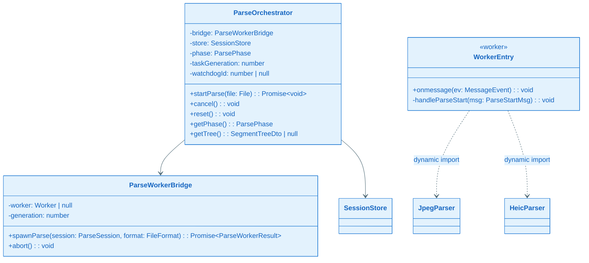
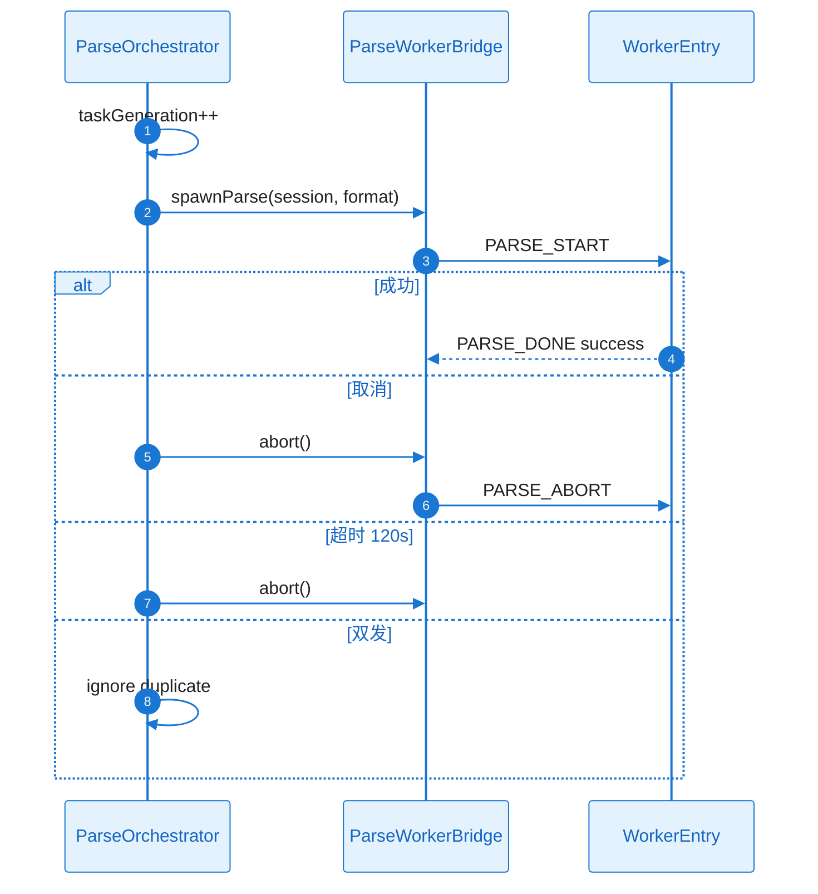

# L2 Story 详细设计：ST-103 Worker 编排

## L2 依赖与引用

| 类型 | 说明 |
| --- | --- |
| **关联 KD** | [`KD_001_session_worker.md`](../../../key-func-design/KD_001_session_worker.md)、[`KD_003_workbench_orchestration.md`](../../../key-func-design/KD_003_workbench_orchestration.md) |
| **前置 ST** | ST-101、ST-401（类型） |
| **对外契约** | `ParseOrchestrator` 公共 API；Worker 消息协议见 `interface-design.md` |

---

## ST-103 Detailed Design：Worker 桥接与解析编排

#### 1) 需求及描述

- **需求描述**：实现解析状态机、Worker 生命周期、取消/超时/防双发（FR-004、FR-006、FR-009）。
- **DoD**：
  - [ ] `[FR-004]` 展示进行中/成功/失败/部分成功/已取消
  - [ ] `[FR-009]` 解析中可取消
  - [ ] `[NFR-REL-001]` 20 次连续操作后仍可恢复
  - [ ] **自检**：DoD 均已映射 FR/NFR

#### 2) 功能设计

**核心实现思路**：继承 KD-001 的 `SessionStore`+`ParseWorkerBridge`；本 Story 实现 `ParseOrchestrator` 与 `src/worker/entry.ts` 路由。选 **Dedicated Worker + terminate 取消** 而非 SharedWorker，原因：取消须硬终止解析循环，SharedWorker 难以保证隔离。

**失败处理**：Worker 错误→`PARSE_FAILED` 透传 UI；超时/取消→`abort()` 不重试；校验失败在 Orchestrator 外由 Ingest 处理。

##### 类图

##### 时序图

#### 协作者与过程说明

Orchestrator 为 ST-103 交付核心；与 KD-001 时序一致，本 Story 补充 `watchdogId` 与 `taskGeneration` 字段实现。WorkerEntry 按 format 动态加载解析器，避免 JPEG MVP 加载 HEIC 库。
