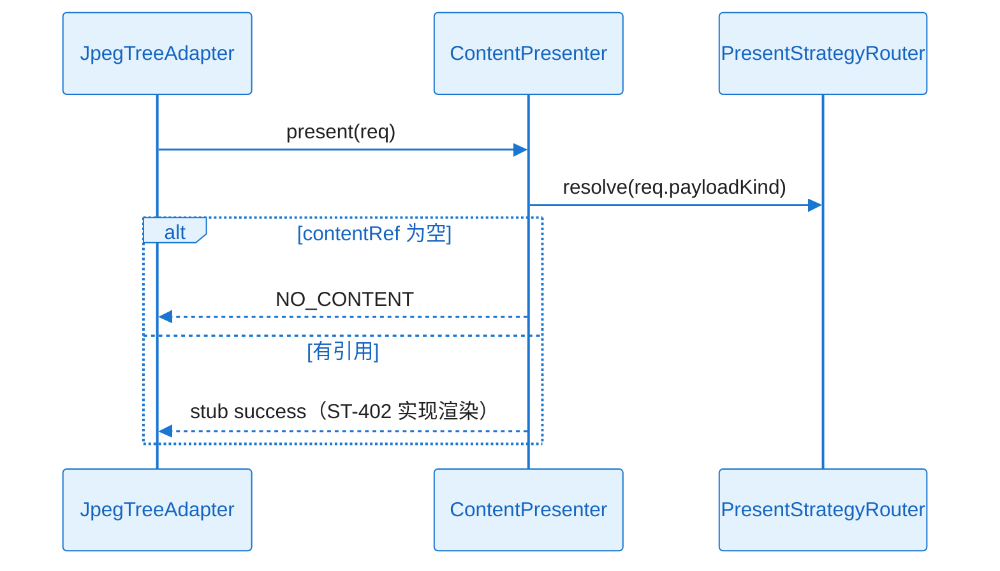

# L2 Story 详细设计：ST-401 呈现契约

## L2 依赖与引用

| 类型 | 说明 |
| --- | --- |
| **关联 KD** | [`KD_002_content_present.md`](../../../key-func-design/KD_002_content_present.md) |
| **前置 ST** | ST-101 |
| **对外契约** | `PresentRequest`/`PresentResult` 类型导出；`ContentPresenter.present` 骨架 |

---

## ST-401 Detailed Design：呈现契约与策略矩阵

#### 1) 需求及描述

- **DoD**：
  - [ ] `[FR-001]` 策略矩阵路由正确
  - [ ] `[FR-007]` 输入输出字段与 `interface-design.md` 一致
  - [ ] `[NFR-SEC-001]` present 不发起网络请求

#### 2) 功能设计

**核心实现思路**：先落地 `src/shared/types/present.ts` 与 `PresentStrategyRouter`（无 DOM），`ContentPresenter` 初版仅返回 stub `PresentResult` 供 002/003 联调。选 **Discriminated Union ViewModel** 而非多组件 props，原因：详情槽单一入口易扩展 mixed 布局。

##### 类图

（与 KD-002 一致，本 Story 实现 `PresentStrategyRouter`+空 `ContentPresenter`）

##### 时序图

#### 协作者与过程说明

ST-401 冻结契约；ST-402 填充 Renderer。单元测试覆盖矩阵每种 PayloadKind 的路由目标。
