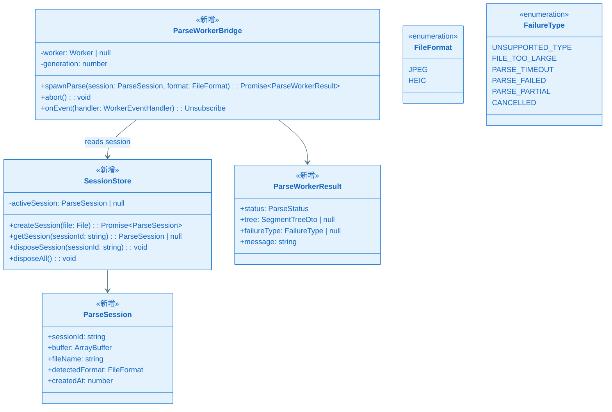
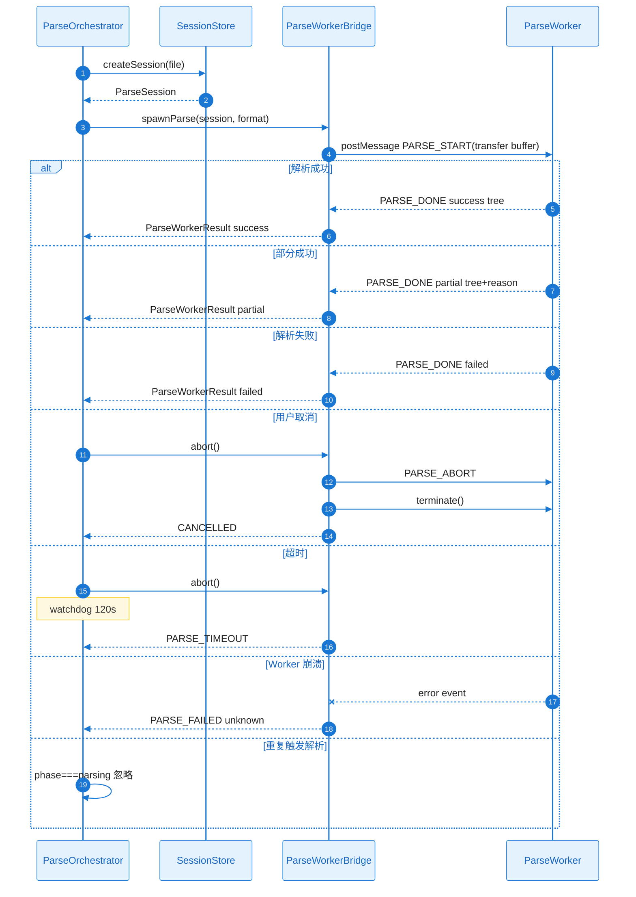

# KD-001：会话与 Worker 解析基建

> **回链**：[`epic-design.md`](../epic-design.md) §七

**Epic**：EPIC-005 - Web 端图片数据解析器  
**KD 编号**：KD-001  
**创建/更新日期**：2026-05-22

---

## 依赖的其他 KD

| 前置 KD | 对应文件 | 本 KD 如何建立在其上 |
| ------- | ---------------------- | -------------------- |
| — | — | 无前置依赖 |

- **类型**：基础框架
- **背景**：浏览器主线程解析大文件会导致 UI 冻结；须单会话单 Worker 任务并支持取消与换文件清理。

## 核心方案

用户在 Shell 完成校验后，`ParseOrchestrator` 调用 `SessionStore.createSession(file)` 将 `File` 读为 **不可变** `ArrayBuffer` 并分配 `sessionId`。`ParseWorkerBridge.spawnParse(sessionId, format)` 创建或复用 Dedicated Worker，发送 `{ type: 'PARSE_START', sessionId, format, buffer: transferable }`（使用 `postMessage` 的 transfer list 传递 buffer 所有权给 Worker，主线程丢弃引用以避免双份内存）。

Worker 内根据 `format` 动态 `import()` `format-jpeg` 或 `format-heic` 的解析入口，返回 `{ type: 'PARSE_DONE', tree, status, reason }` 或进度 `{ type: 'PARSE_PROGRESS' }`。主线程 `ParseWorkerBridge` 将事件转为 `Observable`/`EventTarget` 供 `ParseOrchestrator` 更新 `ParsePhase`。

**取消**：用户点击取消或重新选文件时，Orchestrator 递增 `taskGeneration`，向 Worker 发 `PARSE_ABORT`；Bridge 调用 `worker.terminate()` 并 `SessionStore.disposeSession(oldId)` 释放 buffer。新任务须等新 Worker 实例，避免旧消息乱序。

**超时**：Orchestrator 启动 120s `watchdog`；触发时等同取消并映射 `FailureType.PARSE_TIMEOUT`。

**防双发**：`startParse` 若当前 `phase===parsing` 且 `taskGeneration` 未变，则忽略第二次调用（SC-010）。

### 关键类图

### 核心调用链时序图

#### 协作者与过程说明

1. **触发与入口**：`ParseOrchestrator.startParse()` 在校验通过后调用，对应首条 `createSession`。
2. **协作链**：`SessionStore` 负责 SoR（ArrayBuffer）；`ParseWorkerBridge` 唯一接触 Worker；Orchestrator 不直接 postMessage。
3. **数据流**：Buffer 所有权转移到 Worker；完成后树 DTO 为结构化克隆传回主线程，不含整文件副本。
4. **分支与异常**：
   - 成功/部分成功/失败：Worker 统一 `PARSE_DONE` 携带 `ParseStatus`。
   - 取消/超时：Bridge 终止 Worker，防消息泄漏。
   - Worker 崩溃：映射 `PARSE_FAILED`，UI 可恢复（NFR-REL-001）。
   - 重复触发：Orchestrator 本地短路，无第二次 Worker 任务。
   - N/A 网络错误：纯本地，无 HTTP。
   - N/A 权限：在 Ingest 阶段处理（KD-003）。
   - N/A 并发写：单会话单任务。
5. **结束条件**：`phase` 进入 `success|partial|failed|cancelled` 之一；换文件须先 `disposeAll`。

---

## 边界条件与注意事项

- Worker 脚本须通过 Vite `?worker` 或独立 chunk 同源加载。
- `SegmentTreeDto` 须可结构化克隆；大树注意深度限制。
- 测试：Mock Worker 用 `vitest` worker 替身。
