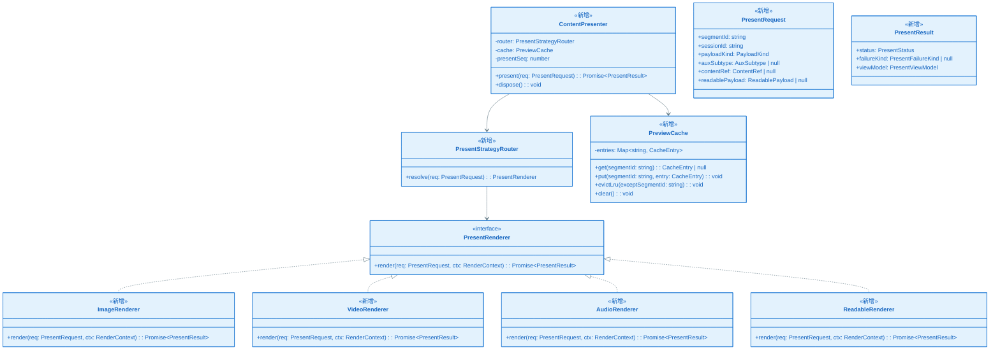
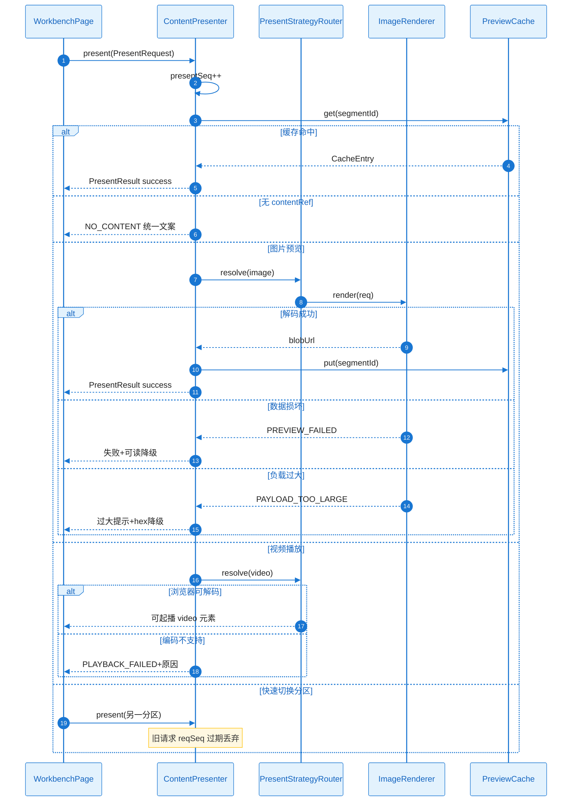

# KD-002：分区内容呈现契约与渲染

> **回链**：[`epic-design.md`](../epic-design.md) §七 | 契约详见 [`interface-design.md`](../interface-design.md)

**Epic**：EPIC-005  
**KD 编号**：KD-002  
**创建/更新日期**：2026-05-22

## 依赖的其他 KD

| 前置 KD | 对应文件 | 本 KD 如何建立在其上 |
| ------- | ---------------------- | -------------------- |
| KD-001 | `./KD_001_session_worker.md` | `ContentRef` 引用会话内 `sessionId`+`byteRange` |

- **类型**：Capability（Owner FEAT-004）

## 核心方案

消费方（`JpegParser`/`HeicParser` 的 UI 适配层）在用户选中 `SegmentNode` 时组装 `PresentRequest`：`segmentId`、`payloadKind`（image/video/audio/metadata/other/mixed）、可选 `auxSubtype`（depth/hdrGain/alpha）、`contentRef`（指向会话 buffer 切片或已解码 Blob URL）、`readablePayload`（字段表或 hex 摘要）。

`ContentPresenter.present(req)` 先经 `PresentStrategyRouter` 按 FR-001 矩阵选路由：**image→ImageRenderer**、**video→VideoRenderer**、**audio→AudioRenderer**、**metadata→ReadableRenderer**、**mixed→先可读再主媒体**。路由前检查 `PreviewCache`：若 LRU 命中且 `reqSeq` 为最新，直接返回缓存的 `PresentResult`。

每次 `present` 递增全局 `presentSeq`；异步解码完成后仅当 `reqSeq===presentSeq` 才更新 UI（SC-010）。失败映射 `PresentFailureKind` 到统一文案键（`copy.ts`），**禁止**假装播放成功（FR-009）。

`PreviewCache` 最多 3 个全分辨率项；插入第 4 个时淘汰最久未访问且非当前 `segmentId` 的项。

### 关键类图

### 核心调用链时序图

#### 协作者与过程说明

1. **触发**：用户选中树节点，`WorkbenchPage` 调用 `ContentPresenter.present`。
2. **职责**：Presenter 为唯一 DOM 媒体操作入口；Format 层只构造 `PresentRequest`。
3. **数据流**：`ContentRef` 从 `SessionStore` 按 range 切片或预建 Blob；缓存存 `blobUrl` 与缩略图。
4. **分支**：空引用、预览失败、过大、播放失败、竞态丢弃——均映射 FR-006 文案；离线已加载仍可呈现（NFR-SEC）。
5. **结束**：`PresentResult.status` 为 `success|failed|degraded`；切换文件调用 `dispose()` 清空 Cache。

---

## 边界条件与注意事项

- Blob URL 须在 `dispose`/`revokeObjectURL` 防止泄漏。
- 深度图允许灰度/伪彩（FR-011）。
- 与 [`KD_004`](./KD_004_jpeg_structure.md)、[`KD_005`](./KD_005_heic_structure.md) 互链：负载判定在 Format，呈现在本 KD。
