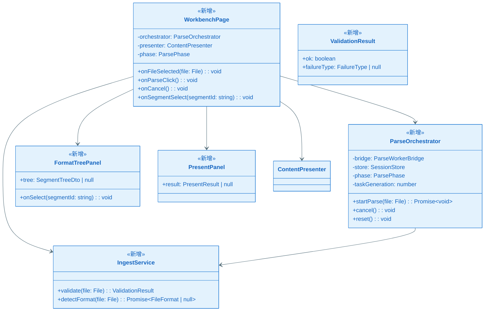
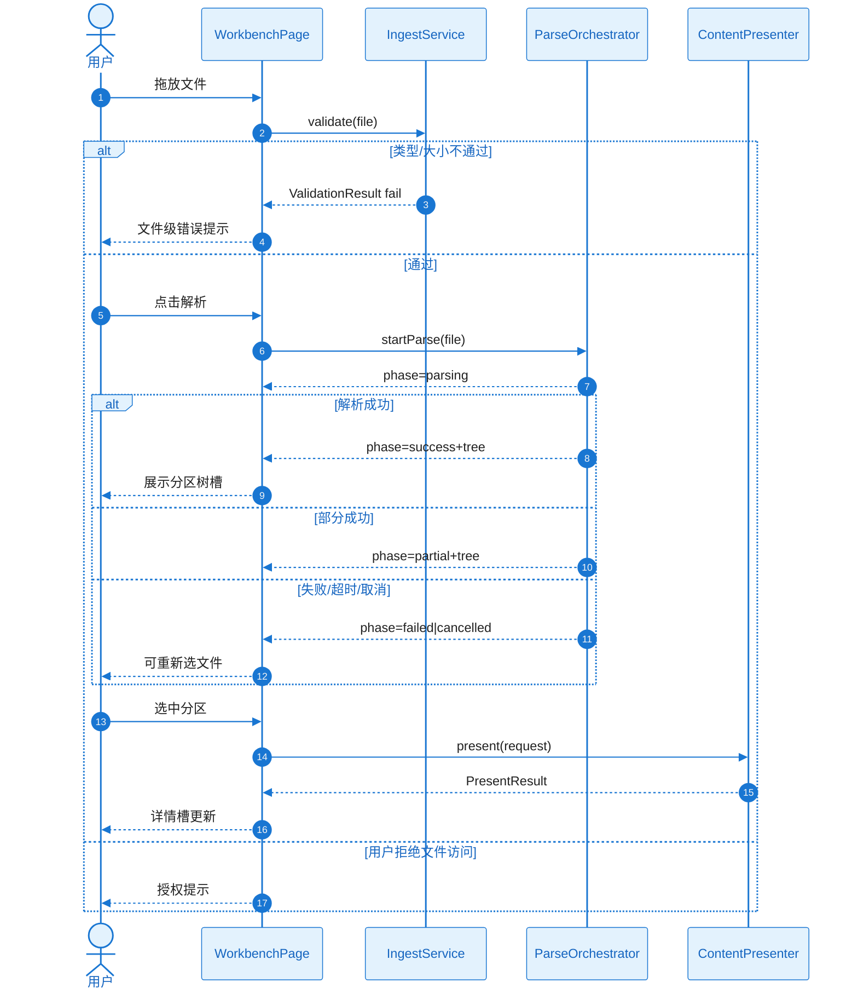

# KD-003：工作台接入与解析编排

> **回链**：[`epic-design.md`](../epic-design.md) §七

**Epic**：EPIC-005  
**KD 编号**：KD-003  
**创建/更新日期**：2026-05-22

## 依赖的其他 KD

| 前置 KD | 对应文件 | 本 KD 如何建立在其上 |
| ------- | ---------------------- | -------------------- |
| KD-001 | `./KD_001_session_worker.md` | 会话与 Worker |
| KD-002 | `./KD_002_content_present.md` | 详情槽调用 ContentPresenter |

- **类型**：Infrastructure（FEAT-001 Owner）

## 核心方案

`WorkbenchPage` 三区布局：**接入区**（拖放/选择/隐私链接）、**分区树槽**（由 `FormatTreePanel` 挂载 002/003 产出）、**详情槽**（`PresentPanel` 包装 `ContentPresenter`）。

`IngestService.validate(file)` 同步检查扩展名白名单与 `file.size≤50MB`，并用文件头魔数二次确认（防改扩展名）。结果 `ValidationResult` 在 1s 内返回（NFR-PERF-002）。

`ParseOrchestrator` 维护 `ParsePhase` 状态机：`idle→validating→parsing→(success|partial|failed|cancelled)`。触发解析时先 `SessionStore.disposeAll()` 清理旧会话，再创建新会话并 `Bridge.spawnParse`。解析结果驱动 `FormatTreePanel` 的 `tree` prop；`partial` 时顶部 `WarningBanner`。

文件级错误由 `FailureCopyMapper` 映射为中文文案，不含完整路径。分区级错误不在此处理。

### 关键类图

### 核心调用链时序图

#### 协作者与过程说明

1. **入口**：拖放/选择文件触发 `validate`；显式按钮触发 `startParse`（FR-004）。
2. **编排**：Orchestrator 独占状态机；Page 只订阅 phase 与 tree。
3. **换文件**：`startParse` 前 `reset()` 终止 Worker 并 `presenter.dispose()`（SC-011）。
4. **异常**：校验失败不进入 parsing；解析失败页面仍可用（FR-007）。
5. **跨 Feature**：树数据来自 Worker 内 002/003，见 KD-004/005。

---

## 边界条件

- 隐私说明首次展示用 `localStorage` 仅存「已读」标记，**不**存文件（可选，若不用存储则每次显示）。
