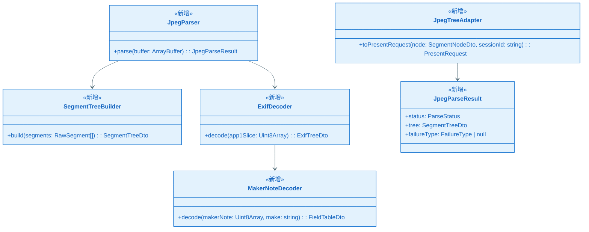
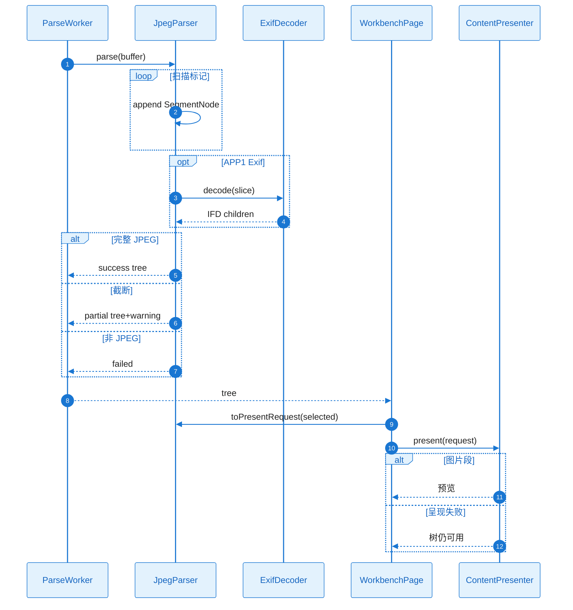

# KD-004：JPEG 结构解析

> **回链**：[`epic-design.md`](../epic-design.md) §七 | 呈现：[`KD_002`](./KD_002_content_present.md)

**KD 编号**：KD-004 | **日期**：2026-05-22

## 依赖的其他 KD

| 前置 KD | 文件 | 说明 |
| ------- | ---- | ---- |
| KD-001 | KD_001_session_worker.md | Worker 内执行 |
| KD-002 | KD_002_content_present.md | 负载类型与 PresentRequest |

## 核心方案

`JpegParser.parse(buffer)` 在 Worker 内顺序扫描 `0xFF` 标记：构建 `SegmentNode` 列表（`markerCode`、`offset`、`length`、`userLabel` 映射 PAR-JPEG-*）。遇 `APP1` 调用 `ExifDecoder`（exifr）展开 IFD 子节点（PAR-JPEG-C01/C06）；`MakerNoteDecoder` 按厂商 ID 路由 Canon/Nikon/Sony 等字段表（FR-011）。

**负载判定**：`SOF`+`SOS` 后熵编码段→`image`；`PAR-JPEG-024` Motion JPEG→`video`；EXIF/IPTC/COM→`metadata`；未知 APP→`other`+`warning=true`（PAR-JPEG-099）。

截断（无 EOI）时仍返回已扫描节点，`ParseStatus.partial`。完全非 JPEG 魔数→`failed`。

选中节点时主线程 `JpegTreeAdapter.toPresentRequest(node, session)` 填充 `contentRef: { sessionId, start, end }` 与 `readablePayload`。

### 关键类图

### 核心调用链时序图

#### 协作者与过程说明

扫描在 Worker 完成，避免阻塞 UI。EXIF/MakerNote 字段级为 P1 验收重点。呈现失败不破坏树（SC-012）。N/A 网络/权限/持久化。

---

## 边界条件

- 渐进式 JPEG：多 SOS 合并为 PAR-JPEG-020 单节点或子扫描列表。
- 样例索引 S-JPEG-* 用于回归测试。
