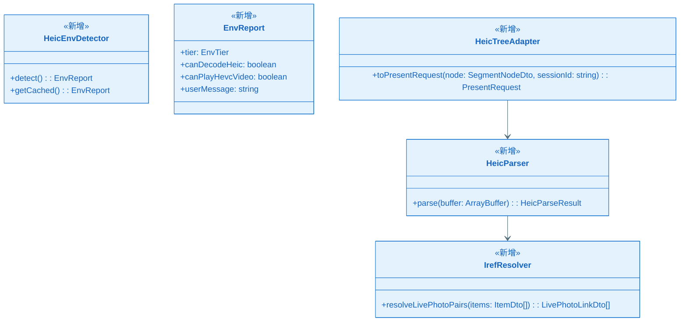
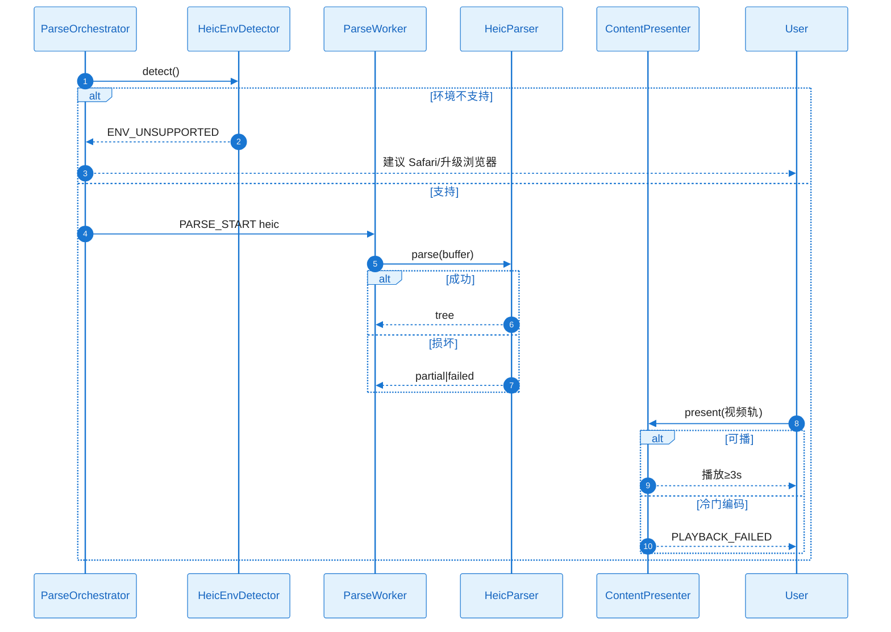

# KD-005：HEIC 结构解析与环境矩阵

> **回链**：[`epic-design.md`](../epic-design.md) §七

**KD 编号**：KD-005 | **日期**：2026-05-22

## 依赖的其他 KD

| 前置 KD | 文件 |
| ------- | ---- |
| KD-001 | KD_001_session_worker.md |
| KD-002 | KD_002_content_present.md |

## 核心方案

主线程在首次 HEIC 解析前调用 `HeicEnvDetector.detect()`：基于 `navigator.userAgent`、`<video>.canPlayType('video/mp4; codecs=hvc1')`、Safari 特性组合映射 `EnvTier`（A/B/C，对应 spec ENV-HEIC-*）。若判定 **不支持完整 HEIC**，在 `startParse` 前即返回 `ENV_UNSUPPORTED` 指引文案（FR-005），不假装成功。

Worker 内 `HeicParser.parse(buffer)` 使用 mp4box 解析 `ftyp→meta→iinf→iloc→iprp` 层级（FR-011）。每个 `item` 生成 `SegmentNode`；`iref` 建立 Live Photo 配对（PAR-HEIC-C02）。视频轨 `trak` 与音频 `soun` **分列**（FR-015）。深度/HDR 项设置 `auxSubtype` 供 KD-002 `ImageRenderer` 伪彩处理。

解析完成后 `HeicTreeAdapter.toPresentRequest` 与 JPEG 口径一致（FR-008）。

### 关键类图

### 核心调用链时序图

#### 协作者与过程说明

环境检测在主线程、解析前执行，区分「环境不支持」与「文件损坏」（NFR-OBS-001）。Live Photo 须同时暴露图项与视频项。音频轨走 FR-010。DRM 项只读说明不破解。

---

## 边界条件

- 10bit/HDR 预览色差标注 LIM-HEIC-01。
- Beta 阶段方启用 ST-301～303 完整验收。
