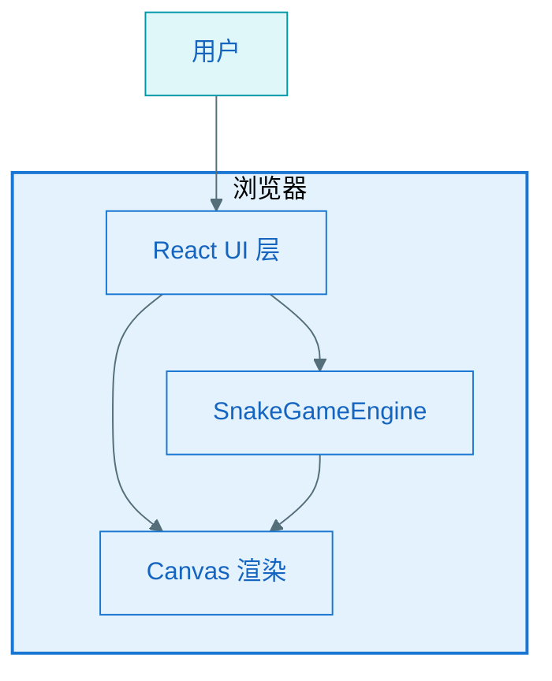
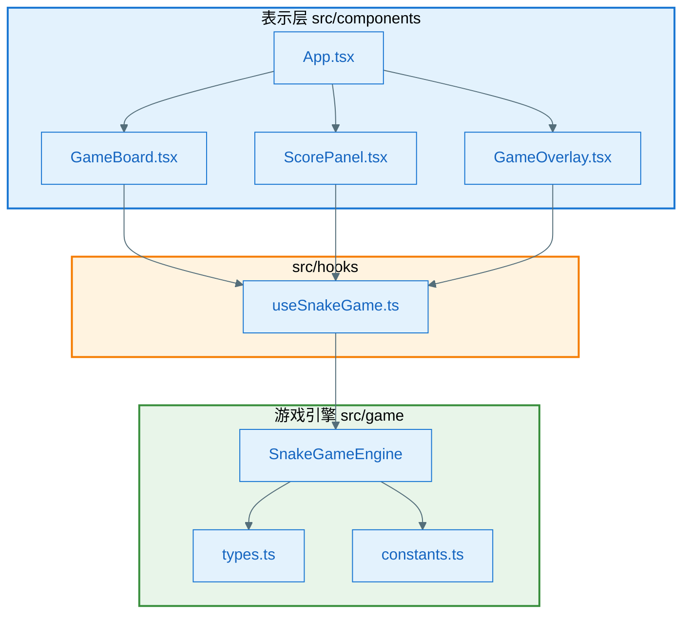
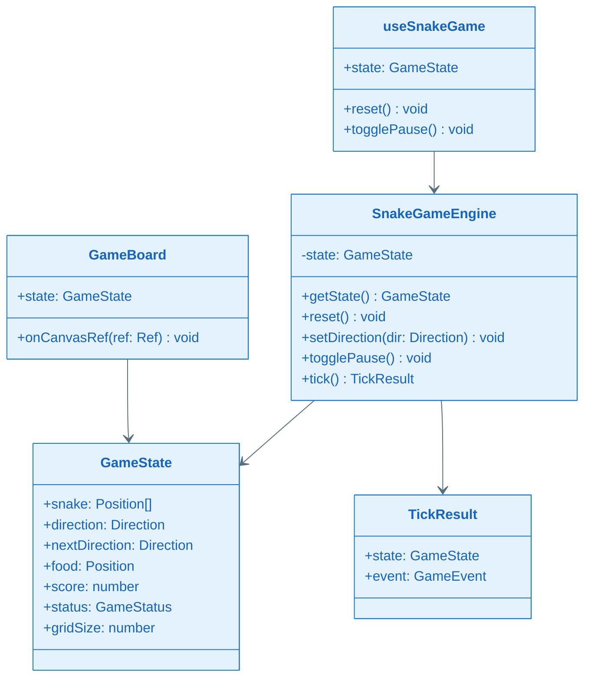
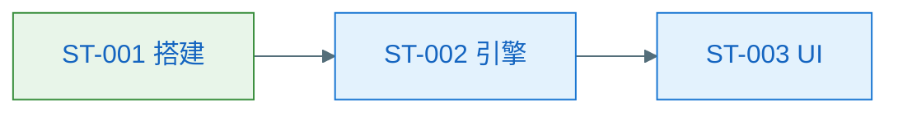

# EPIC 软件设计说明书：EPIC-006 - 贪食蛇网页游戏

**Epic**：EPIC-006
**Design Version**：v0.1.0
**创建日期**：2026-06-28
**输入**：`tech-spec.md` v0.1.0、`spec.md` FEAT-001

---

## §一 设计概述

本 EPIC 交付纯前端贪食蛇网页游戏，采用 React + TypeScript + Vite，游戏逻辑与 UI 分离。

## §二 零层架构

## §三 一层架构（apps/snake-game-web）

## §四 模块职责

| 模块 | 职责 |
|------|------|
| `SnakeGameEngine` | 维护游戏状态、tick 推进、碰撞检测、食物生成 |
| `useSnakeGame` | 连接 Engine 与 React：interval、键盘事件、state 同步 |
| `GameBoard` | Canvas 绑制棋盘、蛇、食物 |
| `ScorePanel` | 显示分数与操作说明 |
| `GameOverlay` | 暂停/游戏结束遮罩与按钮 |

## §五 技术风险与边界场景

| 风险 | 缓解 |
|------|------|
| 快速连按方向键 | 队列最多保留 1 个待处理方向 |
| 食物无处可放 | 蛇占满棋盘时判定胜利/结束 |

## §六 全景类图

### 关键类职责说明

| 类/模块 | 职责 |
|---------|------|
| `SnakeGameEngine` | 游戏状态机与 tick 逻辑核心 |
| `GameState` | 不可变状态快照 |
| `useSnakeGame` | React 集成层，管理 interval 与输入 |
| `GameBoard` | Canvas 绑制 |

## §七 关键功能设计

### §7.1 KD 清单

| KD ID | 名称 | 路径 | 前置 KD |
|-------|------|------|---------|
| KD-001 | 贪食蛇游戏引擎 | `key-func-design/KD_001_snake-game-engine.md` | 无 |

### §7.2 引用

详见 `key-func-design/KD_001_snake-game-engine.md`。

## §八 NFR 评估

N/A：简单 Web 游戏，NFR 已在 tech-spec 硬约束中覆盖；不单独产出 `nfr.md`。

## §九 接口设计

N/A：无外部 API。

## §十 数据库设计

N/A：无持久化。

## §十一 埋点设计

N/A：无埋点要求。

## §十二 Story 拆解

### §12.1 拆解策略

按「工程搭建 → 引擎核心 → UI 集成 →  polish」垂直切片。

### §12.2 Story 列表

| Story ID | 名称 | 目标 | 依赖 | 预估 |
|----------|------|------|------|------|
| ST-001 | 项目搭建与 Canvas 骨架 | Vite+React 项目可运行，空棋盘渲染 | 无 | 0.5d |
| ST-002 | 游戏引擎核心 | SnakeGameEngine 单测通过：移动/吃食物/碰撞 | ST-001 | 1d |
| ST-003 | UI 集成与交互 | 完整可玩：键盘、暂停、重开、计分 | ST-002 | 1d |

### §12.3 Story 自检

- [x] 每个 Story 可独立验收
- [x] FR 全覆盖
- [x] 依赖无环

### §12.4 依赖关系

### §12.5 FR/NFR 覆盖矩阵

| FR/NFR | Story |
|--------|-------|
| FR-001 | ST-001, ST-003 |
| FR-002 | ST-002, ST-003 |
| FR-003 | ST-002 |
| FR-004 | ST-002, ST-003 |
| FR-005 | ST-003 |
| FR-006 | ST-003 |
| NFR-PERF-001 | ST-001 |
| NFR-PERF-002 | ST-002 |
| AC-001~006 | ST-003 |

## §十三 L2 详细设计索引

| Story | L2 文件 | 说明 |
|-------|---------|------|
| ST-001 | — | 简单 Story，由 tasks.md DoD 承接 |
| ST-002 | — | 引擎逻辑见 KD-001 |
| ST-003 | — | UI 集成，由 tasks.md DoD 承接 |
