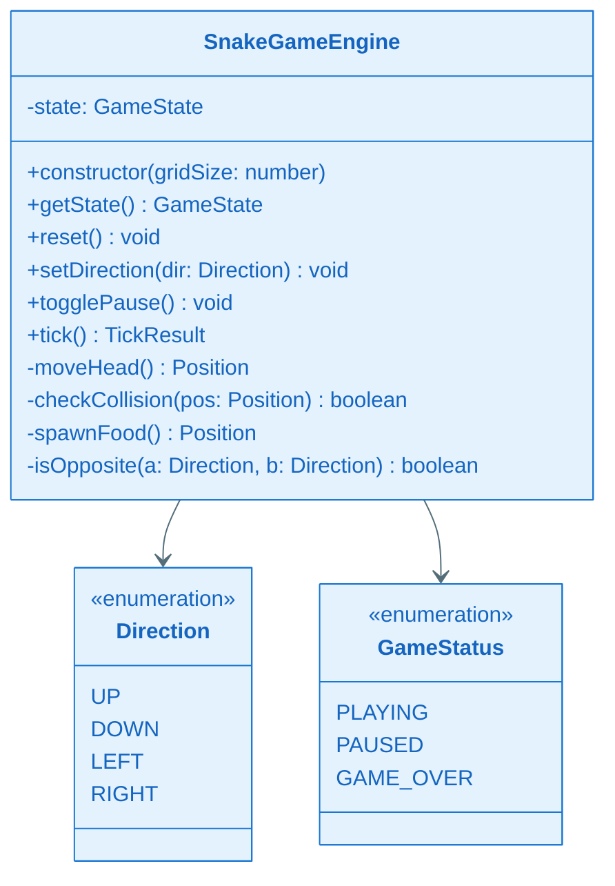
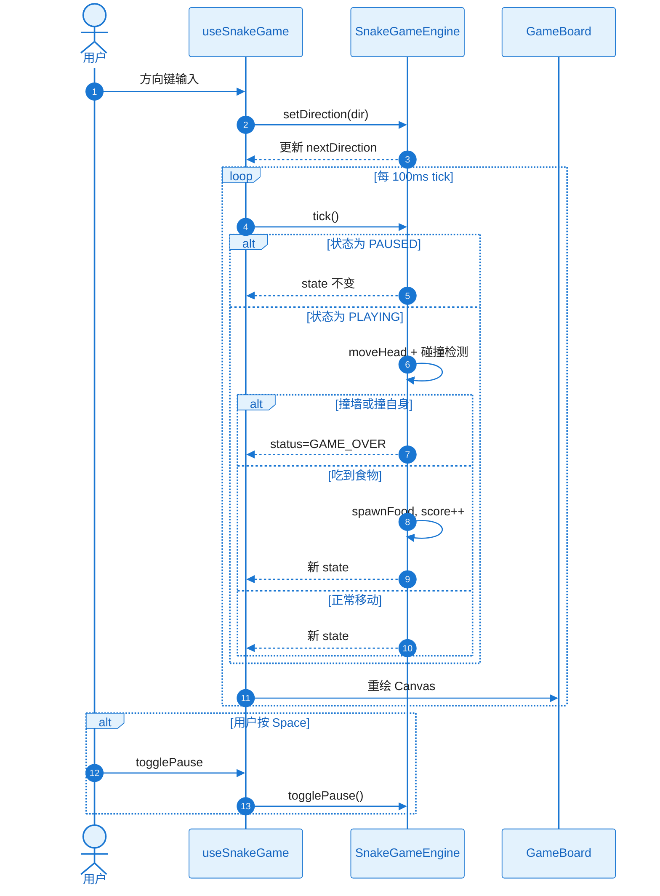

# KD-001：贪食蛇游戏引擎

**关联 Story**：ST-002
**前置 KD**：无

## 核心方案

`SnakeGameEngine` 为纯 TypeScript 类，不依赖 React。每次 `tick()` 根据当前方向移动蛇头，检测碰撞，处理吃食物逻辑，返回新 `GameState`。

## 关键类图

## 核心调用链时序图

### 协作者与过程说明

1. **触发与入口**：用户通过键盘改变方向或暂停；`useSnakeGame` 注册 `keydown` 监听并调用 Engine。
2. **协作链**：Hook 持有 Engine 实例；interval 驱动 `tick()`；tick 结果通过 React setState 触发 UI 重绘。
3. **数据流**：Engine 内部维护不可变 state 副本；每次 tick 返回新对象。
4. **分支与异常**：
   - 暂停：tick 早返回，不移动
   - 碰撞：status 置 GAME_OVER
   - 禁止反向：`setDirection` 忽略与当前方向相反输入
   - N/A 网络/持久化/权限/并发/空状态（棋盘满时 game over）
5. **结束条件**：GAME_OVER 或用户 reset。
