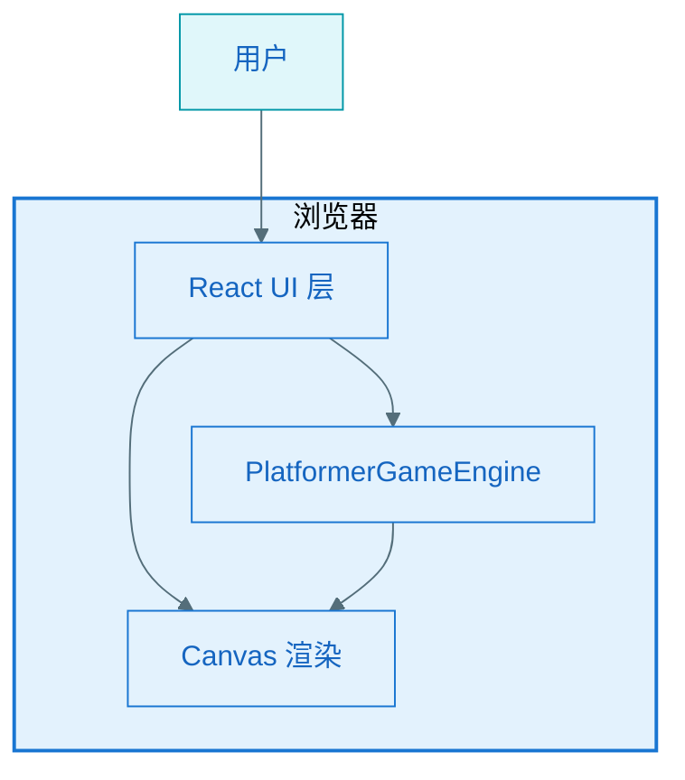
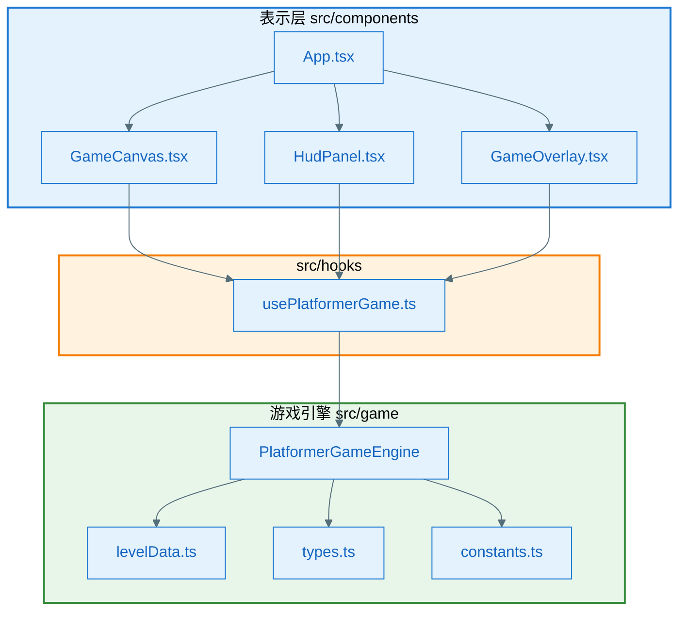
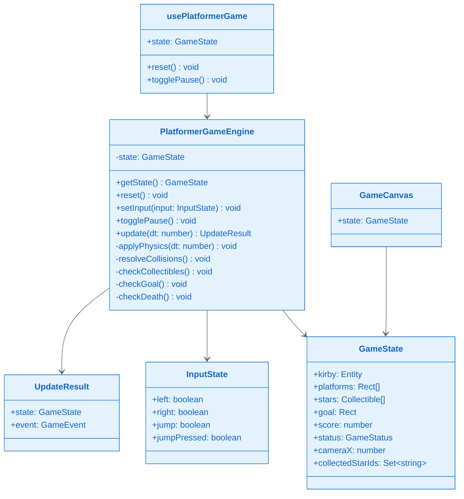
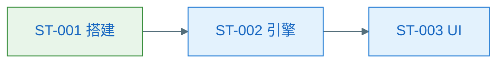

# EPIC 软件设计说明书：EPIC-007 - 星之卡比跳跃小游戏

**Epic**：EPIC-007
**Design Version**：v0.1.0
**创建日期**：2026-06-28
**输入**：`tech-spec.md` v0.1.0、`spec.md` FEAT-001

---

## §一 设计概述

本 EPIC 交付纯前端卡比主题横版跳跃网页游戏，采用 React + TypeScript + Vite，游戏逻辑与 UI 分离，Canvas 2D 渲染。

## §二 零层架构

## §三 一层架构（apps/kirby-platformer-web）

## §四 模块职责

| 模块 | 职责 |
|------|------|
| `PlatformerGameEngine` | 维护游戏状态、物理更新、AABB 碰撞、收集与通关判定 |
| `usePlatformerGame` | 连接 Engine 与 React：rAF 循环、键盘事件、state 同步 |
| `GameCanvas` | Canvas 绘制关卡、卡比、星星、旗杆；应用镜头偏移 |
| `HudPanel` | 显示分数、操作说明、游戏状态 |
| `GameOverlay` | 暂停/通关/失败遮罩与按钮 |

## §五 技术风险与边界场景

| 风险 | 缓解 |
|------|------|
| 平台边缘抖动 | 落地时 vy 归零；水平碰撞分离 |
| 快速连跳 | 仅 grounded 时可跳；离开平台后不可二段跳 |
| 镜头边界 | cameraX clamp 到 [0, levelWidth - viewport] |

## §六 全景类图

### 关键类职责说明

| 类/模块 | 职责 |
|---------|------|
| `PlatformerGameEngine` | 横版跳跃物理与碰撞核心 |
| `GameState` | 不可变状态快照 |
| `usePlatformerGame` | React 集成层，管理 rAF 与输入 |
| `GameCanvas` | Canvas 绑制与镜头变换 |

## §七 关键功能设计

### §7.1 KD 清单

| KD ID | 名称 | 路径 | 前置 KD |
|-------|------|------|---------|
| KD-001 | 卡比平台跳跃引擎 | `key-func-design/KD_001_kirby-platformer-engine.md` | 无 |

### §7.2 引用

详见 `key-func-design/KD_001_kirby-platformer-engine.md`。

## §八 NFR 评估

N/A：简单 Web 游戏，NFR 已在 tech-spec 硬约束中覆盖。

## §九 接口设计

N/A：无外部 API。

## §十 数据库设计

N/A：无持久化。

## §十一 埋点设计

N/A：无埋点要求。

## §十二 Story 拆解

### §12.1 拆解策略

按「工程搭建 → 引擎核心 → UI 集成 → polish」垂直切片。

### §12.2 Story 列表

| Story ID | 名称 | 目标 | 依赖 | 预估 |
|----------|------|------|------|------|
| ST-001 | 项目搭建与 Canvas 骨架 | Vite+React 项目可运行，空关卡渲染 | 无 | 0.5d |
| ST-002 | 平台跳跃引擎核心 | PlatformerGameEngine 单测通过：移动/跳跃/碰撞/收集/通关 | ST-001 | 1.5d |
| ST-003 | UI 集成与交互 | 完整可玩：键盘、镜头、暂停、重开、计分 | ST-002 | 1d |

### §12.3 Story 自检

- [x] 每个 Story 可独立验收
- [x] FR 全覆盖
- [x] 依赖无环

### §12.4 依赖关系

### §12.5 FR/NFR 覆盖矩阵

| FR/NFR | Story |
|--------|-------|
| FR-001 | ST-001, ST-003 |
| FR-002 | ST-002, ST-003 |
| FR-003 | ST-002 |
| FR-004 | ST-003 |
| FR-005 | ST-002, ST-003 |
| FR-006 | ST-002, ST-003 |
| FR-007 | ST-002, ST-003 |
| FR-008 | ST-003 |
| FR-009 | ST-003 |
| NFR-PERF-001 | ST-001 |
| NFR-PERF-002 | ST-002 |
| AC-001~008 | ST-003 |

## §十三 L2 详细设计索引

| Story | L2 文件 | 说明 |
|-------|---------|------|
| ST-001 | — | 简单 Story，由 tasks.md DoD 承接 |
| ST-002 | — | 引擎逻辑见 KD-001 |
| ST-003 | — | UI 集成，由 tasks.md DoD 承接 |
