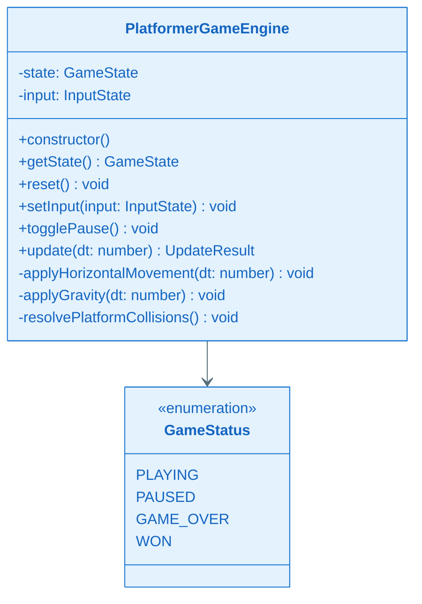
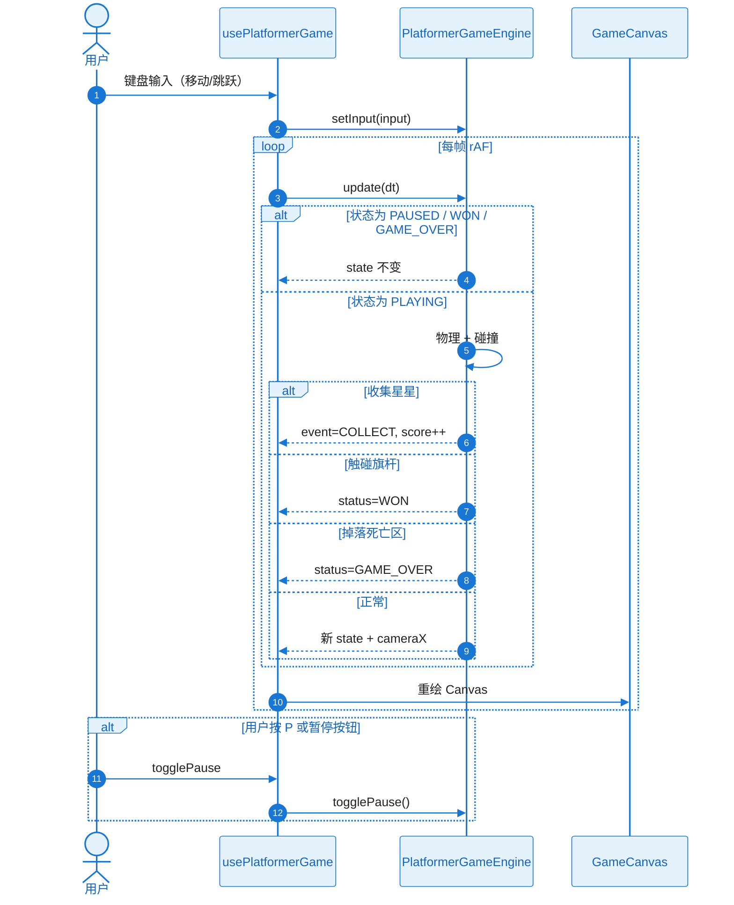

# KD-001：卡比平台跳跃引擎

**关联 Story**：ST-002
**前置 KD**：无

## 核心方案

`PlatformerGameEngine` 为纯 TypeScript 类，不依赖 React。每次 `update(dt)` 根据输入应用水平加速度、重力、AABB 平台碰撞，检测星星收集、旗杆通关与掉落失败，返回新 `GameState`。

## 关键类图

## 核心调用链时序图

### 协作者与过程说明

1. **触发与入口**：用户通过键盘控制移动与跳跃；`usePlatformerGame` 注册 `keydown`/`keyup` 并维护 `InputState`。
2. **协作链**：Hook 持有 Engine 实例；`requestAnimationFrame` 驱动 `update(dt)`；结果通过 React setState 触发 Canvas 重绘。
3. **数据流**：Engine 内部维护 state；每次 update 基于 dt 推进物理；cameraX 由 kirby.x 推导。
4. **分支与异常**：
   - 暂停：update 早返回，不推进物理
   - 通关：status 置 WON
   - 掉落：status 置 GAME_OVER
   - 跳跃：仅 grounded 时响应 jumpPressed
   - N/A 网络/持久化/权限/并发/空状态
5. **结束条件**：WON / GAME_OVER 或用户 reset。
