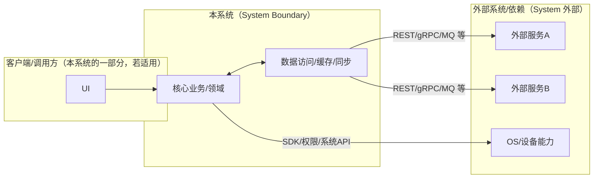
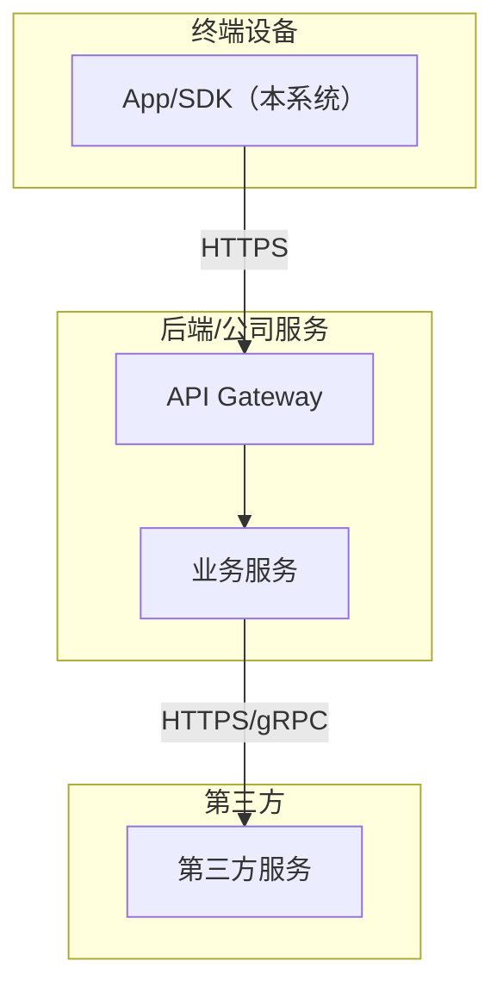
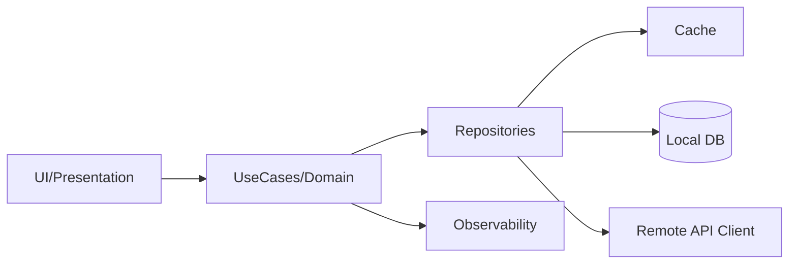
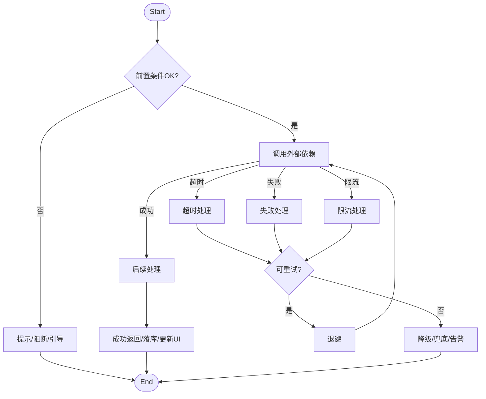
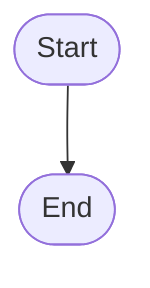

# Plan（工程级蓝图）：[Feature 名称]

**Epic**：EPIC-[编号] - [名称]
**Feature ID**：FEAT-[编号，例如 001]
**Feature Version**：v0.1.0（来自 `spec.md`）
**Plan Version**：v0.1.0
**当前工作分支**：`[epic/... 或 story/... ]`
**Feature 目录**：`specs/epics/EPIC-[编号]-[short-name]/features/FEAT-[编号]-[short-name]/`
**日期**：[YYYY-MM-DD]
**输入**：来自 `Feature 目录/spec.md`

> 规则：
> - Plan 阶段必须包含工程决策、风险评估、算法/功耗/性能/内存评估（量化 + 验收指标）。
> - Implement 阶段**不得**擅自改写 Plan 的技术决策；若必须变更，走增量变更流程并提升 Version。

## 变更记录（增量变更）

| 版本 | 日期 | 变更范围（Feature/Story/Task） | 变更摘要 | 影响模块 | 是否需要回滚设计 |
|---|---|---|---|---|---|
| v0.1.0 | [YYYY-MM-DD] | Feature | 初始版本 |  | 否 |

## 概述

[摘自 Feature 规格说明：核心需求 + 本 Plan 的关键工程决策与取舍]

## Plan-A：工程决策 & 风险评估（必须量化）

### A1. 技术选型（候选方案对比 + 决策理由）

| 决策点 | 候选方案 | 优缺点 | 约束/风险 | 决策 | 决策理由 |
|---|---|---|---|---|---|
| [例如：本地存储] | A / B / C |  |  |  |  |

### A2. 0 层架构设计（对外系统边界、部署、通信、交互）

> 定义：0 层架构设计反映“本系统与外部系统之间的关系”。必须覆盖：结构、部署、通信方式、交互方式与边界。
>
> 要求：
> - 同时给出“一句话描述每个模块/外部系统的职责与边界”。
> - 明确外部依赖的**故障模式**（超时/限流/不可用/返回不一致）与本系统应对策略（重试/降级/兜底/提示）。
> - 明确通信方式（协议/鉴权/重试/幂等/超时/限流）与部署拓扑（端/服务/第三方）。

#### A2.1 外部系统与依赖清单（必须）

| 外部系统/依赖 | 类型（三方/内部服务/设备能力） | 关键能力/数据 | 通信方式（协议/鉴权） | SLA/限流/超时 | 故障模式 | 我方策略 |
|---|---|---|---|---|---|---|
| [例如：Auth Service] | 内部服务 | Token/权限 | HTTPS+OAuth2 | p95≤? / QPS≤? / timeout=? | 超时/限流 | 重试+降级 |

#### A2.2 0 层架构图（系统边界 + 外部交互）



#### A2.3 部署视图（必须）

> 要求：说明各节点部署位置（端上/服务端/第三方）、网络边界、以及关键链路的通信方式。



#### A2.4 通信与交互说明（必须）

- **协议**：REST / gRPC / WebSocket / MQ / 文件 / 设备能力（按实际选择）
- **鉴权**：OAuth2 / JWT / mTLS / API Key（按实际选择）
- **超时与重试**：超时阈值、最大重试次数、退避策略、重试白名单接口
- **幂等**：哪些请求必须幂等、幂等键策略
- **限流**：外部限流策略与我方退避/降级
- **数据一致性**：强一致/最终一致、补偿策略

### A3. 1 层架构设计（系统内部框架图 + 模块拆分 + 接口协议）

> 定义：1 层架构设计描述“系统内部的模块拆分与协作”，包括框架图、模块职责、模块交互、通信方式、接口协议等。

#### A3.1 1 层框架图（必须）



#### A3.2 模块拆分与职责（必须）

| 模块 | 职责 | 输入/输出 | 依赖 | 约束 |
|---|---|---|---|---|
| [模块A] |  |  |  |  |

#### A3.3 模块协作与通信方式（必须）

> 要求：写清楚“谁调用谁、通过什么方式、传什么、失败如何处理”。如果是异步（队列/事件），必须写清楚消费语义与重放/去重。

- **调用关系**：[模块A → 模块B → 模块C]
- **通信方式**：函数调用 / Binder / HTTP / gRPC / MQ / 事件总线（按实际）
- **接口协议**：数据结构、版本策略、错误码、重试/幂等约束（引用 B4 或 contracts/）
- **并发与线程模型**：关键协作点的并发策略与共享状态保护

#### A3.4 关键模块设计（详细设计 + 取舍，必须）

> 要求：对“关键模块/高风险模块/承载 NFR 的模块”做细化。若包含多个模块，则分模块说明。

##### 模块：[模块名，如 Cache / Sync Engine / Auth / Scheduler]

- **模块定位**：[它解决什么问题、在 1 层架构中的位置]
- **设计目标**：[性能/功耗/一致性/可扩展性/可观测性等]
- **核心数据结构/状态**：[关键实体/状态机/缓存键/索引]
- **对外接口（协议）**：[输入/输出、错误码、版本策略、幂等要求]
- **策略与算法**：[缓存淘汰/LRU、批处理、合并、退避、优先级等]
- **失败与降级**：[超时/限流/不可用/数据损坏/回滚策略]
- **安全与隐私**：[敏感数据处理、加密、权限]
- **可观测性**：[关键日志/指标/埋点]
- **优缺点**：
  - **优点**：[为什么这样做更好]
  - **缺点/代价**：[维护复杂度/资源消耗/边界问题]
  - **替代方案与否决理由**：[A/B/C 对比与否决原因]

#####（Capability Feature 场景）交付物与接入契约（若适用则必填）

> 适用：本 Feature 为“埋点/可观测性”“动效合集/组件库”“算法能力/模型SDK”等横切能力时。

- **交付物形态**：SDK / 资源包 / 配置 / 模型文件 / 服务接口（按实际）
- **对外接口（业务接入）**：初始化方式、调用方式、依赖注入点、生命周期要求
- **事件/协议/契约**：事件名/字段/版本；API 协议；资源命名规范；模型输入输出张量定义（按实际）
- **版本与兼容策略**：SemVer/灰度/回滚；向后兼容策略；弃用策略
- **验收标准**：可测量的完成定义（性能/正确性/稳定性/合规），并明确验证入口

#####（算法 Capability Feature 场景）算法交付与工程化清单（若适用则必填）

- **模型提供**：模型来源/版本/训练数据假设（引用来源，不在此新增训练决策）
- **推理部署**：端侧/服务端；运行时（如 NNAPI/自研 runtime）；模型下发/更新策略
- **工程化封装**：算法 SDK/API；线程与资源控制；缓存；降级与回退（无模型/低端机/失败）
- **评估与监控**：离线/线上指标；漂移监测；告警；灰度策略

### A4. 关键流程设计（每个流程一张流程图，含正常 + 全部异常）

> 定义：关键流程设计必须用**流程图（flowchart）**描述，且流程图中必须覆盖正常流程与所有关键异常分支（失败/超时/并发/生命周期等）。
>
> 要求：
> - 若存在多个关键流程（如“登录”“同步”“下单”“上传”等），则每个流程单独一张图。
> - 每张图必须包含：触发条件、关键决策点、外部依赖调用、重试/降级/兜底路径、最终可观测信号（日志/指标/埋点）。

#### 流程 1：[流程名称]



#### 流程 2：[流程名称]



### A5. 技术风险与消解策略（绑定 Story/Task）

| 风险ID | 风险描述 | 触发条件 | 影响范围 | 严重度 | 消解策略 | 对应 Story/Task |
|---|---|---|---|---|---|---|
| RISK-001 |  |  |  | High/Med/Low |  | ST-??? / T??? |

### A6. 边界 & 异常场景枚举（数据/状态/生命周期/并发/用户行为）

- **数据边界**：[空/超大/非法/重复/过期等]
- **状态边界**：[状态机不可达/回退/重入等]
- **生命周期**：[前后台切换/旋转/进程被杀/恢复等]
- **并发**：[多线程/协程/并发写/竞态等]
- **用户行为**：[快速连点/断网/弱网/权限拒绝等]

### A7. 算法评估（如适用）

- **目标**：[要优化什么？]
- **指标**：[准确率/召回率/误报率/时延等]
- **验收标准**：[量化阈值]
- **测试方法**：[离线数据集/线上灰度/AB/回放]
- **风险**：[数据漂移/极端样本/可解释性]

### A8. 功耗评估（必须量化）

- **Top5% 用户模型**：[设备/网络/使用频次/场景]
- **测量口径**：[电流/唤醒/网络请求/定位等]
- **预估增量**：每日 \(mAh\) 增量 ≤ [阈值]（或每次操作平均 ≤ [阈值]）
- **验收上限**：[明确上限与失败处置]
- **降级策略**：[达到阈值时如何降级/关闭]

### A9. 性能评估（必须量化）

- **前台**：[关键路径 p50/p95/p99 时延预算与阈值]
- **后台**：[任务时延/调度频次/失败重试]
- **验收指标**：[阈值 + 测试方法]
- **降级策略**：[缓存/降采样/降精度/延后等]

### A10. 内存评估（必须量化）

- **峰值增量**：≤ [阈值] MB
- **平均增量**：≤ [阈值] MB
- **生命周期**：[在哪些生命周期阶段常驻/释放]
- **风险与对策**：[泄漏点/大对象/缓存策略]
- **验收标准**：[测试方法 + 阈值]

## Plan-B：技术规约 & 实现约束（保留原 spec-kit 输出内容）

### B1. 技术背景（用于统一工程上下文）

> 注意：为保证工具链自动提取信息，下列字段名需保留英文 Key（括号内可补充中文）。

**Language/Version**：[例如：Kotlin 2.x / Java 17 / 需明确]
**Primary Dependencies**：[例如：Jetpack Compose、Room、Ktor 或 需明确]
**Storage**：[如适用，例如：Room/SQLite、DataStore、文件 或 N/A]
**Test Framework**：[例如：JUnit、Robolectric、XCTest、pytest 或 需明确]
**Target Platform**：[例如：Android 8+、iOS 15+、Linux server 或 需明确]
**Project Type**：[single / web / mobile - 决定源码结构]
**Performance Targets**：[例如：60fps、启动耗时、p95 时延等 或 需明确]
**Constraints**：[例如：p95 <200ms、内存 <100MB、离线可用等 或 需明确]
**Scale/Scope**：[例如：DAU、数据规模、页面数等 或 需明确]

### B2. 架构细化（实现必须遵循）

- **分层约束**：[例如：UI 只能调用 Domain；Domain 不能依赖 UI]
- **线程/并发模型**：[主线程/IO/协程/锁策略]
- **错误处理规范**：[统一错误码/异常封装/用户提示]
- **日志与可观测性**：[结构化字段、采样、敏感信息脱敏]

### B3. 数据模型（引用或内联）

- 若已有 `data-model.md`：在此引用并补充关键约束
- 若未单独拆分：在此列出实体、字段、关系、状态机与校验规则

### B4. 接口规范/协议（引用或内联）

- 若已有 `contracts/`：在此引用端点/协议文件
- 明确版本策略、兼容策略、错误响应格式

### B5. 合规性检查（关卡）

*关卡：必须在进入 Implement 前通过；若不通过，必须明确整改项并绑定到 Story/Task。*

[基于章程/合规性文件确定的检查项]

### B6. 项目结构（本 Feature）

```text
specs/[###-feature-short-name]/
├── spec.md                     # Feature 规格说明（/speckit.specify）
├── plan.md                     # 本文件（/speckit.plan）
├── full-design.md               # 全量技术方案文档（/speckit.fulldesign）
├── tasks.md                    # 任务拆解（/speckit.tasks）
├── research.md                 # 可选：调研产物
├── data-model.md               # 可选：数据模型
├── quickstart.md               # 可选：快速验证/联调指南
└── contracts/                  # 可选：接口契约
```

### B7. 源代码结构（代码库根目录）

<!--
  需执行操作：将下方的占位目录树替换为该功能的具体目录结构。
  删除未使用的选项，并使用实际路径扩展选定的结构（例如：apps/admin、packages/something）。
-->

```text
# 选项1：单项目（默认）
src/
tests/

# 选项2：Web 应用
backend/
frontend/

# 选项3：移动应用 + 接口
api/
android/ 或 ios/
```

**结构决策**：[记录选定的结构，并引用上述捕获的实际目录]

## Story Breakdown（Plan 阶段末尾，必须）

> 规则：
> - Story 是 Feature 的最小可开发单元，用于覆盖对应 FR/NFR。
> - Story 类型必须标注：Functional / Design-Enabler / Infrastructure / Optimization。
> - 这里**只做拆分与映射**，不生成 Task；Task 在 `/speckit.tasks` 阶段生成，且不得改写这里的设计决策。

### Story 列表

#### ST-001：[标题]

- **类型**：Functional / Design-Enabler / Infrastructure / Optimization
- **描述**：[做什么、为什么]
- **目标**：[可验证的结果]
- **覆盖 FR/NFR**：FR-???；NFR-???
- **依赖**：[其他 Story / 外部依赖]
- **可并行**：是/否（原因）
- **关键风险**：是/否（关联 RISK-???）
- **验收/验证方式（高层）**：[如何判断完成；细化到 tasks.md]

#### ST-002：[标题]

- （同上结构）

### Feature → Story 覆盖矩阵

| FR/NFR ID | 覆盖的 Story ID | 备注 |
|---|---|---|
| FR-001 | ST-001 |  |
| NFR-PERF-001 | ST-002 |  |

## 复杂度跟踪（仅当合规性检查存在需说明理由的违规项时填写）

| 违规项 | 必要性说明 | 舍弃更简单方案的原因 |
|---|---|---|
| [例如：第4个子项目] | [当前需求] | [为何更简单方案不满足] |